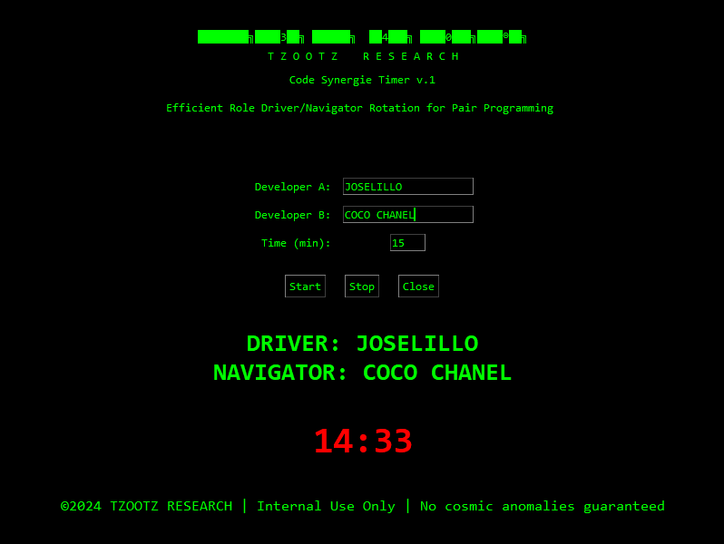

# TZOOTZ RESEARCH - Pair Timer

**Efficient Role Rotation Timer for Pair Programming**\
Welcome to the **TZOOTZ RESEARCH - Pair Timer**, a modern tool designed to enhance collaboration in classic Pair Programming by automating the role rotation process. Designed with precision and a dash of retro aesthetic, this app keeps you and your coding partner engaged, focused, and in sync.

---


## ✨ Features

- **Automated Role Switching**: Rotates Driver and Navigator roles based on customizable time intervals.
- **Minimalistic Visual Timer**: A clean, retro-styled countdown timer to keep track of session progress.
- **User-Friendly Setup**: Input developer names and session durations directly through the intuitive interface.
- **TZOOTZ Branded Aesthetic**: Retro ASCII branding paired with dark mode design for long coding sessions.

---

## 🔧 Installation and Usage

1. **Clone the Repository**:

   ```bash
   git clone https://github.com/yourusername/your-repo-name.git
   cd your-repo-name
   ```

2. **Run the Application**:

   - Ensure you have Python 3.x installed.
   - Launch the app using:
     ```bash
     python pair_timer.py
     ```

3. **Configure Your Session**:

   - Enter Developer A and Developer B names.
   - Set your desired session duration (in minutes).
   - Click "Start" to begin the timer.

4. **Monitor Roles and Timer**:

   - The app automatically swaps roles after each interval.
   - Pause or stop the timer as needed.

---

## 🔄 How It Works

This application uses **Tkinter** for its graphical interface and features a backend timer that triggers role swapping at the end of each countdown cycle. The current roles are always displayed to keep both developers aligned.

---

## 🔹 TZOOTZ RESEARCH Branding


```
████████╗██████╗ ██████╗  █████╗ ███╗   ███╗███████╗
T Z O O T Z    R E S E A R C H
```

This project embodies the **TZOOTZ RESEARCH** philosophy: blending efficiency with design to elevate collaborative workflows. The timer's interface reflects our commitment to both functionality and aesthetic appeal.

---

## ⚡ Roadmap

- **Session History**: Logging and analytics for completed Pair Programming sessions.
- **Custom Themes**: Personalize the look and feel of the interface.
- **Audio Alerts**: Add audio cues for role switches.
- **Cloud Sync**: Store and manage session data across devices.

---

## 📄 License

This project is licensed under the MIT License. See the `LICENSE` file for details.quiero debajo de 

